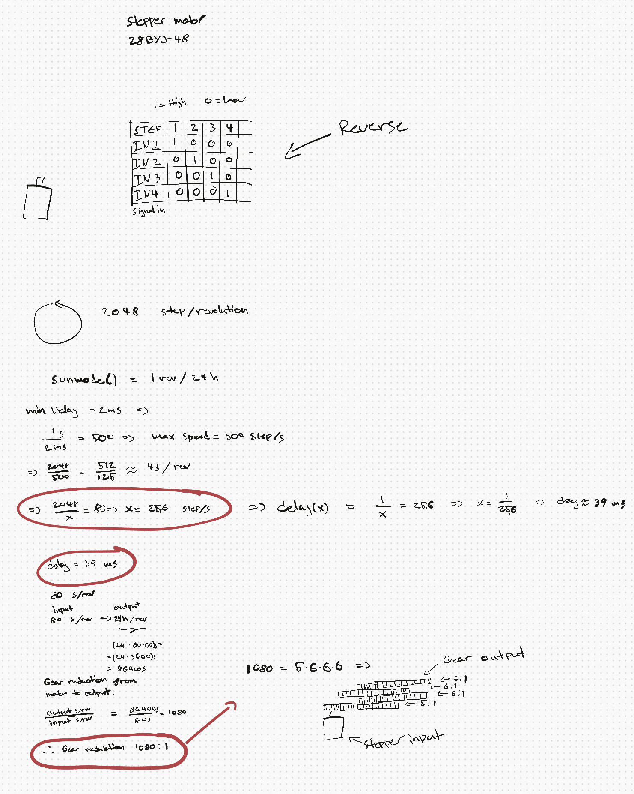
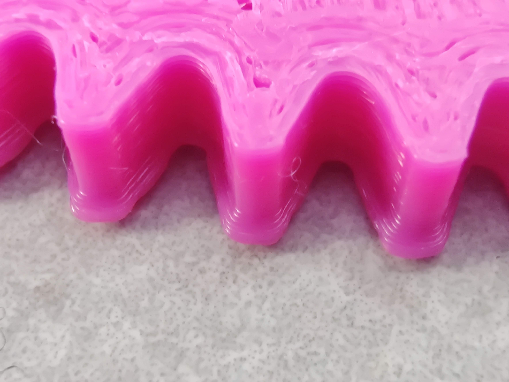
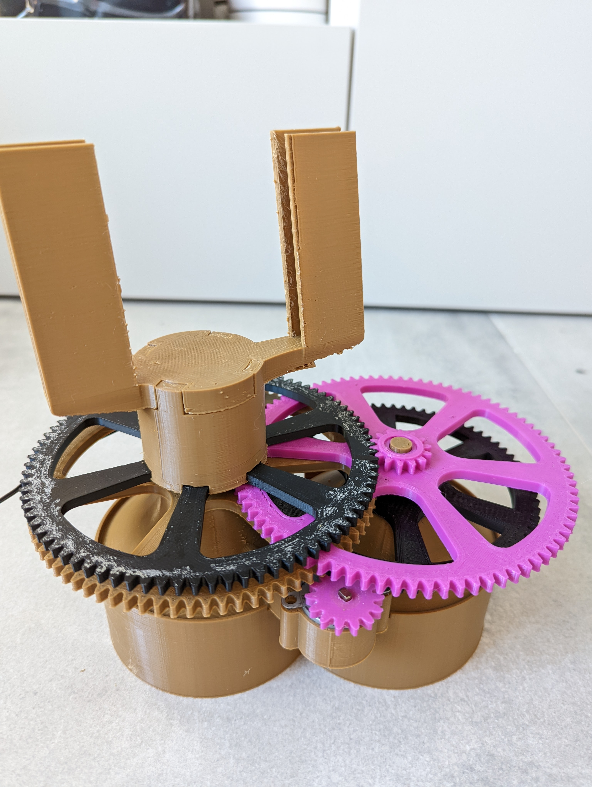

# time-lapse-gadget
# Allan Gamal

  <h2>Time lapse gadget</h2>
  
Sharing some of the process of the making of this project/p>

  <h2>Project</h3>
    
Making a time lapse thinghy that when putting your phone on, in a timelapse mode, it will follow the sun in x-direction, making cool timelapse videos.

   <h2>Thoughts and goals going into the project</h3>
     <ul>
        <li>Make a slowly rotating time lapse machine to put your phone on</li>
        <li>Making it as cheep as possible</li>
        <li>Project may not taking more than a week</li>
        <li>Making it reasonable portable </li>
        <li>Making it easy to assemble without tools</li>
        <li>Make a housing for the electronics and for a powerbank to fit in</li>

</ul>

  <h2>Recognizing some potential issues</h2>
    <ul>
        <li>Large diameter nozzle (0.8mm), making 3d printed gears fairly large</li>
        <li>Flex in the system, making the system potentially wobble</li>
        <li>System for finding center of mass in phone, making the system potentially wobble</li>
        <li>Overcoming the friction of the system using only a small motor</li>
   </ul>
---

<h3>Hardware/materials</h3>
    <ul>
        <li>Stepper motor 28BYJ-48</li>
        <li>Stepper motor driver ULN2003</li>
        <li>Arduino UNO</li>
        <li>3D printer and PLA+ filament</li>
   </ul>

**Lets start**

The only reason I chose this motor was because I had it laying around, and I wanted to make it as cheap as possible. The stepper motor is rated for 2048 steps/rev, wich is very accurate but not very strong. 
For the stepper motor to be able to have enough torque to rotate the phone,
a balance must be find between having enough gear reduction, and not using too many gears (will increase friction in the system). I am not using any bearings
to make it as sheep as possible.

The final gear reduction from motor input to output is 1080:1. This does allow a fairly good traction of the sun in x-direction, not perfect. 
Here is some math:

**Gears**

The reason gears was picked in this configuration, without some protective housing, is because it looks cool! 
Having only a 0.8mm nozzle for 3D printing, a somewhat high tolerance of .2 was used, which was a good choice since I have some problems with elephant foot with my 3d-printer:

**Result**

I'm fairly happy with the results. The camera/phone tracks the sun fairly well, but it is drifting just a little bit. 
I didn't want to spend too much time or money on it, but some thoughts on improvements:

Using smaller gears, and making more gears/more gear reduction making the system more accurate. The small motor seems to handle the friction just fine. 
The system does not have a tight fit or bearings, and when mounting the phone will make the system wobble a tiny bit, enough to see on the time lapse. 

Here is some images:

